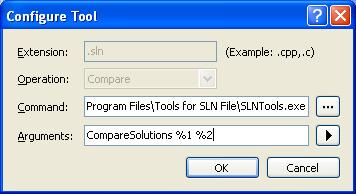
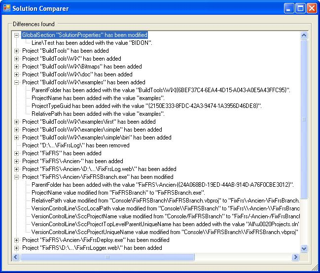

### How to access the compare function

Right now, the only way to use the compare function is via the command line. The format is:
SLNTools.exe CompareSolutions <old.sln> <new.sln>

Usually, this command should be set in the options of the source control plugin.  For Team Foundation Client, the options can be found in the "Tools \ Options \ Source Control \ Visual Studio Team Foundation Server \ Configure User Tools..." menu in Visual Studio. You can then add a specific Compare operation associated to SLN files, like this:
     

I assume that other source control applications have a feature similar to this. 

### User interface

When solutions are compared, the result looks like this:

### How does it work

Comparing solutions in SLNTools work like this:
# The solution files are read and all the elements associated to a project are linked to the GUID of the project (ex. project attributes, project sections, Source Control lines, Project Configuration Platforms lines, Nested Projects lines). The lines not related to a specific project are linked to the global section in which they are defined (ex. Solution Configuration Platforms lines).
# Then, the comparison is made on all the elements that were found, using the project GUID or section name or attribute name or line name as the key in the comparison:
## If an element is found in the old solution but cannot be found in the new solution, an "element has been removed" item is added to the result tree.
## If an element is found in the new solution but cannot be found in the old solution, an "element has been added" item is added to the result tree.
## If an element is found in both solutions then the childs of the element are compared in a similar way. By example, if a project is found in both solution but one of the attribute associated to the project has been removed, the result tree would show "Project X has been modified" and under it another node would show "Attribute Y has been removed".