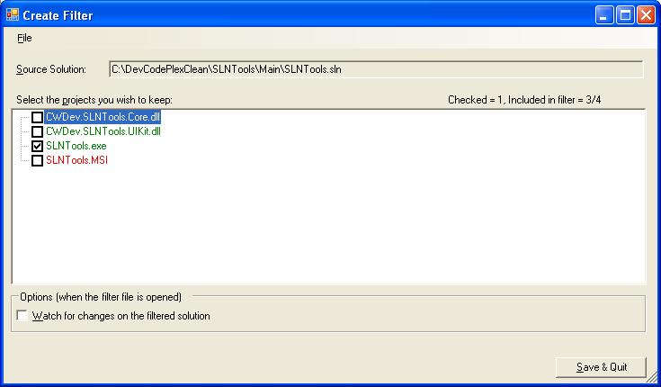
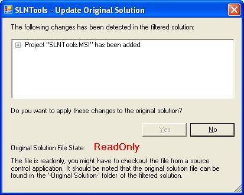
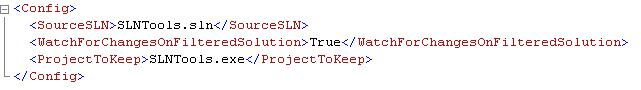

### How to access the filter functions

The filter functions "Create", "Edit" and "Open" can be accessed via the command line The formats are:
SLNTools.exe CreateFilterFileFromSolution <SourceSolution.sln>
SLNTools.exe EditFilterFile <FilterFile.slnfilter>
SLNTools.exe OpenFilterFile <FilterFile.slnfilter> {"[/Wait](_Wait)"}

Those functions can also be accessed via file type commands that are created by the installer. A "Create Filter" command is associated to the '.sln' extension. And "Open" and "Edit" commands are associated to the '.slnfilter' file (with "Open" as the default command).  

### User interface

When creating or editing a filter, the following user interface is used:

When a project name in the tree view is written in green, this means that the project has been checked by the user or the project is a dependency of one of the checked projects. If a solution folder is selected, all the childs of that solution folder will be included in the filtered solution, along all theirs dependencies.

By default, the open filter function does not have a user interface but, if the "Watch for changes on the filtered solution" option is selected, the following dialog will appear if the filtered solution is modified:

### How does it work

First of all, it should be noted that the functions to create or edit a filter file does not create the final filtered solution. Only a file containing the rules for the filtering is created. The content of the file looks like this: 

This mean that the filtering is dynamic. By example, if a reference is added to a "project to keep" in the source solution, the filtered solution will include the referenced project the next time the filter file is opened without having to edit the filter file.

Filtering solutions in SLNTools work like this:

# When a filter file is opened, the original solution specified in the filter file is read and a filtered solution is created using the "project to keep" list. If the "Watch for changes on the filtered solution" option is set to true, a solution folder "-OriginalSolution-" is also added to the filtered solution.
# SLNTools open the "filtered solution" normally (i.e. Visual Studio is started).
# If the "Watch for changes on the filtered solution" is set to false and the command line parameter "/Wait" is not set then SLNTools close. If not, SLNTools stay alive until Visual Studio is closed.
# If the "Watch for changes on the filtered solution" then SLNTools try to detect changes made to the filtered solution. When changes are detected, SLNTools offer the user the choice to apply those changes in the original solution.

Known bugs and limitations 

* When SLNTools try to determine the dependencies of a project, only the following project types are supported: C#, J#, VisualBasic, VisualC, Visual Studio Setup, Web Project, SolutionFolder, any project that use the same format as managed project (i.e. xpath for references = "//ProjectReference"). 
* If the "Watch for changes on the filtered solution" **is not used**, all the changes that are made to the filtered solution are not saved. This means that you need to open and edit the "original solution" to make any changes that modify the solution file (i.e. adding a new project, removing a project, Solution Level Project Dependencies, properties of a web projects, etc).
* If the "Watch for changes on the filtered solution" is used, there are some types of changes to the filtered solution that cannot be applied correctly to the original solution. By example, adding a project that already existed in the original solution will end up as a duplicate in the original solution. I plan on handling those cases in the future. This feature is still experimental so use it with care.
