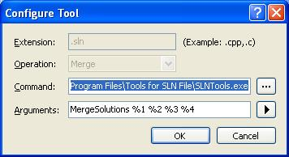
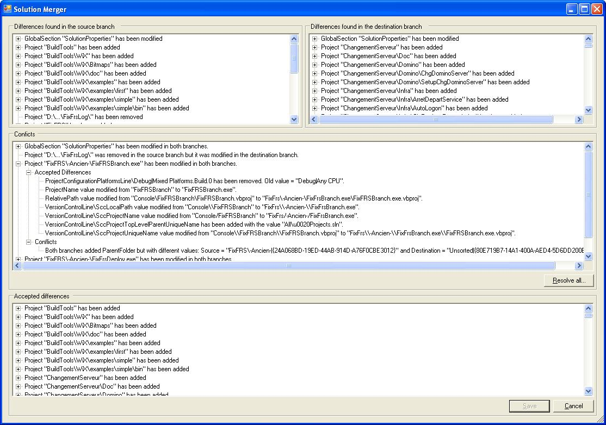
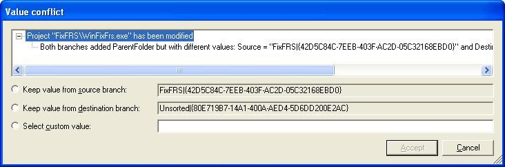
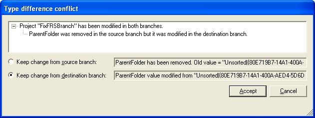

### How to access the merge function

Right now, the only way to use the merge function is via the command line. The format is:
SLNTools.exe MergeSolutions <SourceBranch.sln> <DestinationBranch.sln> <CommonAncestror.sln> <Result.sln>

Usually, this command should be set in the options of the source control plugin.  For Team Foundation Client, the options can be found in the "Tools \ Options \ Source Control \ Visual Studio Team Foundation Server \ Configure User Tools..." menu in Visual Studio. You can then add a specific Merge operation associated to SLN files, like this:

I assume that other source control applications have a feature similar to this. 

### User interface

When solutions are merged, the result look like this:

And, when the 'Resolve All...' button is clicked, the following conflict dialog might appear:

### How does it work

Merging solutions in SLNTools work like this:
# The "SourceBranch.sln" file is compared normally with "CommonAncestror.sln" file (see [SLNTools Compare](SLNTools-Compare) for more details).
# The "DestinationBranch.sln" file is compared normally with "CommonAncestror.sln" file (see [SLNTools Compare](SLNTools-Compare) for more details).
# Then, a merge of the differences is made, using the project GUID or section name or attribute name or line name as the key in the comparison:
## If a difference is found only in one branch then the difference is added to the 'Accepted Differences' list.
## If the same difference is found in both branches then the difference is added to the 'Accepted Differences' list. By example, if both branches removed the project X. 
## If a diverging difference is found, then a conflict is added to the 'Conflicts' list. By example, if both branches want to modify an attribute but with a different value.
# Once the merge is completed, the user needs to click on the button 'Resolve All...' and this will start a series of conflict resolution dialog. Only two types of conflict need to be resolved by the user:
## A 'value conflict' where both branches added or modified a line or attribute but with a different value. By example, the source branch changed the ProjectName to "AwesomeName" while the destination branch changed the same attribute to "NotSoGoodName".
## A 'type conflict' where both branches made a different type of changes on an element. This type of conflict can only happen when one branch modified an element while the other branch removed the same element. Usually, the 'removed' difference should be kept.
# Once all the conflict has been resolved, the user can click on the "Save" button. SLNTools then apply all the "Accepted Differences" on the "CommonAncestror.sln" file and save the result in the "Result.sln" file.

### Known bugs and limitations

* Because SLNTools is using the GUID of a project as the key when merging solutions, it is possible for one branch to add a project "A" with a GUID "X" while the other branch add the same project "A" but with a different GUID "Y". In that case, the resulting solution will contain both projects because SLNTools will not have detected a conflict. The problem will only be detected when opening the resulting solution. If the added project is a "Solution Folder" then it's not so bad because Visual Studio will rename one the folder to 'A (2)". But if the project is a regular project then Visual Studio will show the error 'The project "A" has already been added' and only one of the projects named "A" will be loaded. I plan to add a validation of the resulting solution to detect those cases in the future.  